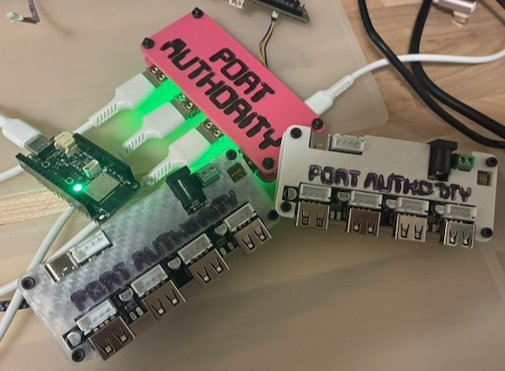
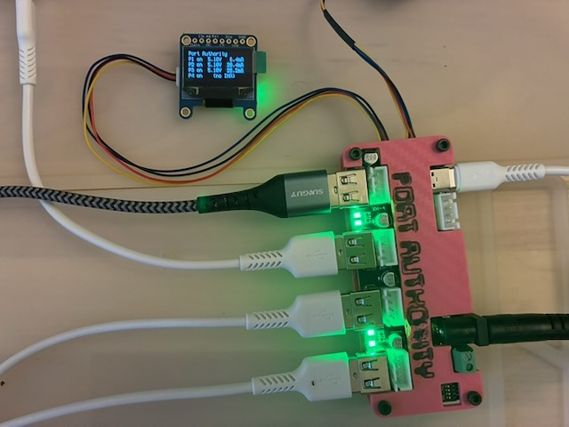
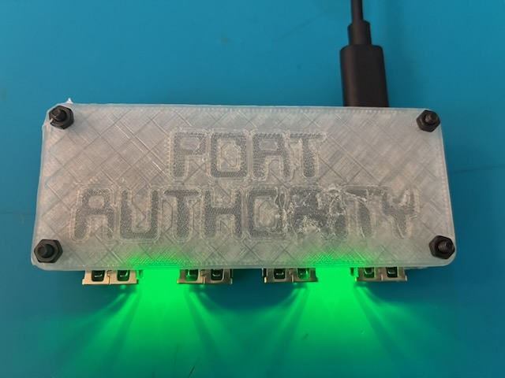
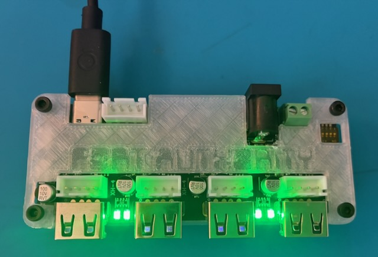
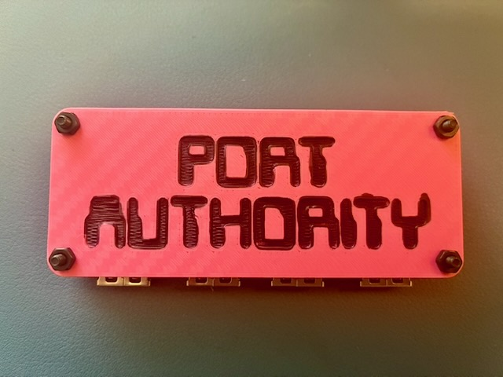
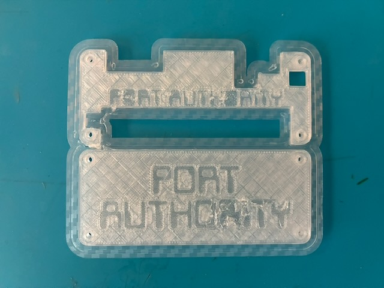
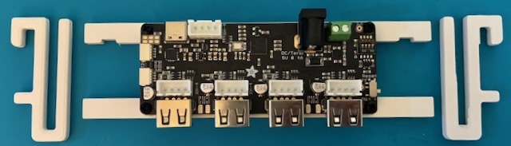
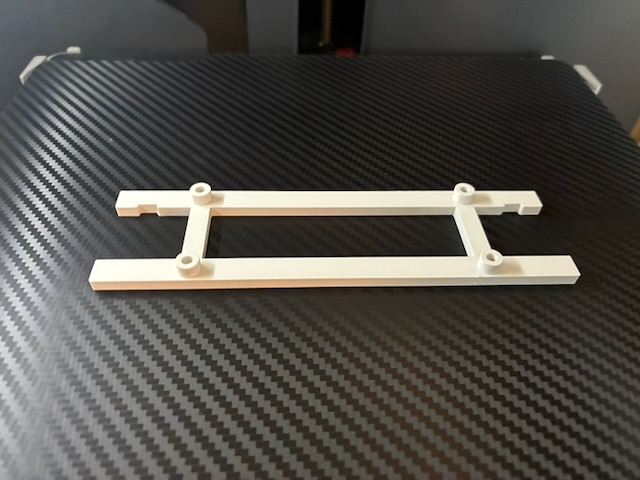

# hil-hub-port-authority

Test notes, scripts and cases for the **Port Authority** 4-port USB hub
(Adafruit Smart HIL Hub Rev C), first JLC run, tested 2026-09-24 to 2026-10-01.

USB2514B hub with per-port power switching (`uhubctl`), INA3221 current
monitoring on ports 1-3, two STEMMA QT ports, external 5 V input and DIP
config modes.

Short summary: [docs/testing-summary.md](docs/testing-summary.md).

## Works

| Feature | Result |
|---|---|
| Per-port power | Clean cutoffs, Linux and macOS, no sudo |
| Power cycling | Feather M0, RP2040, RP2350, ESP32 V2 |
| Current monitoring | Ports 1-3, within ~5% of a USB meter |
| Port current | 1.17 A+ continuous per port |
| Green port LEDs | Follow port power |
| SW1 reset, external 5 V | Both work |
| DIP `0 0 0 1` | Reports bus-powered |
| EEPROM mode `1 1 1 1` | Works once programmed; custom name and serial |
| STEMMA2 + OLED | Live per-port status display |
| SWD through the hub | RP2350 flash and verify in 11.2 s |
| USB chaining | Works, see concern 2 |

## Concerns

1. **STEMMA QT back-feeds an unpowered controller.** Its 3.3 V rail sits at
   0.98 V with its port off; a Feather RP2040 lands in the bootloader about
   1 in 10 boots. Fix: an I2C buffer with power-off isolation (PCA9517A or
   TCA9617A, unverified). Now: keep the controller always powered.
2. **A chained hub with an ESP32 V2 never recovers after its upstream port
   is cut.** It loops connect/disconnect forever. Fine empty, with native-USB
   boards, or with the V2 on the top-level hub. Keep USB-serial boards on the
   top-level hub.

## Doesn't work

- SMBus DIP mode `1 1 1 0`: hub never enumerates. Parked.
- EEPROM mode as shipped: the EEPROM is blank. Program it with
  `test-scripts/eeprom_write.py`.
- Pi 4 plus drive on one port browns out at 1.24 A peaks.

## Untested

- I2C chaining (needs the A0 jumper)
- Red fault LED
- JST-XH connectors

## Linux setup

Full notes: [docs/host-setup.md](docs/host-setup.md).

- `apt install uhubctl` plus udev rules for the hub and the per-port
  `disable` files. Don't use `uhubctl -S`.
- Address boards by `/dev/serial/by-path`, not `ttyACM` numbers.
- SWD on RP2350 needs the [raspberrypi openocd fork](https://github.com/raspberrypi/openocd).

## Repo

| Path | Contents |
|---|---|
| [docs/](docs/) | findings, full test log, test plan, host setup, summary |
| [test-scripts/](test-scripts/) | test scripts, see its README |
| [case/sandwich/](case/sandwich/) | two-plate case: FreeCAD script, FCStd, STEP, 3MF |
| [case/skadis/](case/skadis/) | IKEA SKADIS frame: FreeCAD script, FCStd, STEP, 3MF, STL |

Build a case with `freecadcmd build_case.py`; it also writes the STLs left
out of the repo.

| | |
|---|---|
|  |  |
|  |  |
|  |  |

## License

MIT, see [LICENSE](LICENSE).
